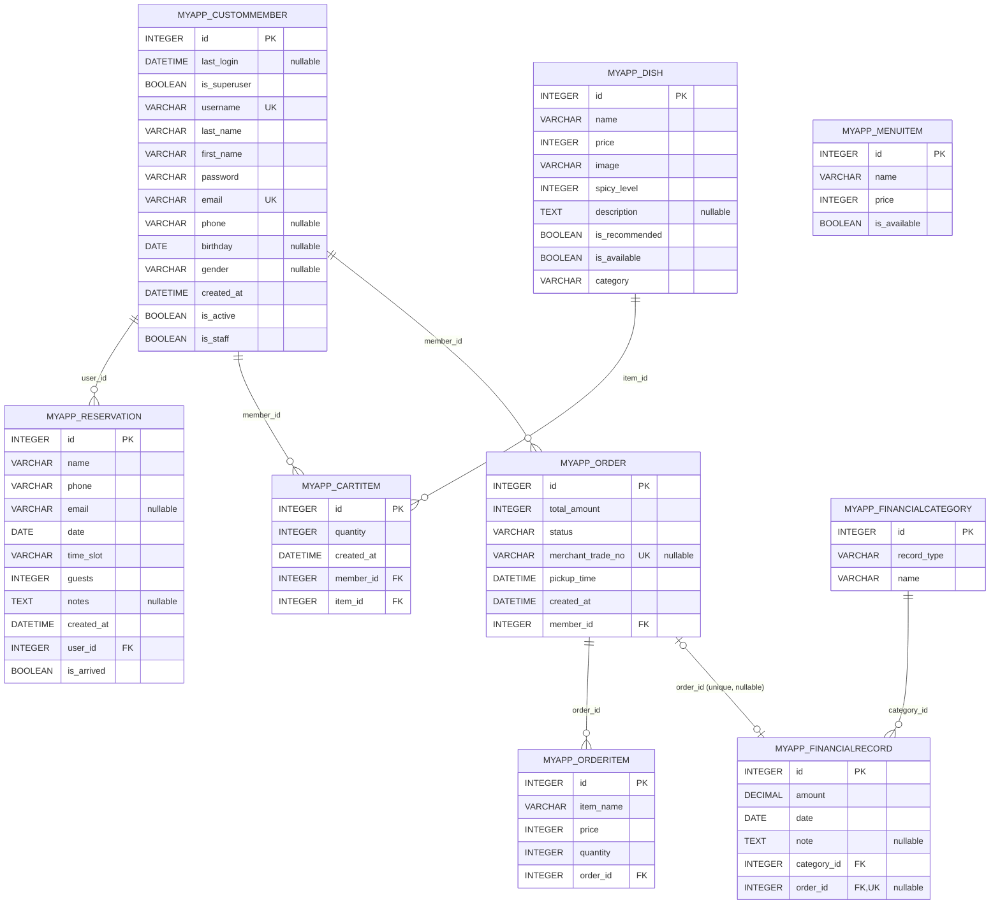
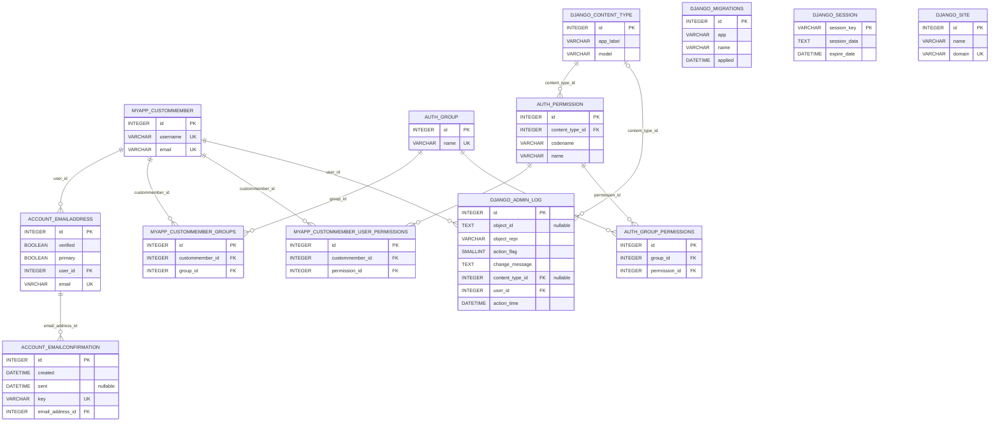

# db.sqlite3 實際資料庫結構與 ER 圖

> 來源：直接讀取目前 `db.sqlite3` 的 SQLite metadata（table info、foreign keys、unique indexes）。

## 資料表總覽

目前共有 **21 張資料表**：

- 核心業務表（9）：`myapp_custommember`、`myapp_dish`、`myapp_menuitem`、`myapp_reservation`、`myapp_cartitem`、`myapp_order`、`myapp_orderitem`、`myapp_financialcategory`、`myapp_financialrecord`
- 會員權限中介表（2）：`myapp_custommember_groups`、`myapp_custommember_user_permissions`
- Django／登入套件系統表（10）：`account_emailaddress`、`account_emailconfirmation`、`auth_group`、`auth_group_permissions`、`auth_permission`、`django_admin_log`、`django_content_type`、`django_migrations`、`django_session`、`django_site`

## 核心業務 ER 圖

## 帳號、權限與 Django 系統 ER 圖

## 關聯重點

- 一位會員可有多筆訂位、購物車項目及訂單。
- 一道菜可出現在多筆購物車項目中。
- 一張訂單可有多筆訂單明細；訂單明細儲存餐點名稱與價格快照，**沒有直接外鍵連到 `myapp_dish`**。
- 一個財務科目可有多筆財務紀錄。
- `myapp_financialrecord.order_id` 可為空且有唯一約束，因此訂單與財務紀錄為「雙方皆可不存在的一對一」。
- `myapp_menuitem`、`django_migrations`、`django_session`、`django_site` 沒有外鍵關聯。
- SQLite metadata 中的外鍵刪除動作均為 `NO ACTION`；`CASCADE`、`PROTECT`、`SET_NULL` 等行為主要由 Django ORM 的 model 設定處理。

